# Photos des précédentes rencontres

<table>
<tr>
<th>Date</th><th>Évènement</th>
</tr>
<tr>
<td>06/05/2011</td><td>[Soirée Envers et TorqueBox](Main.201105-envers-torquebox)</td>
</tr>
<tr>
<td colspan="2">
[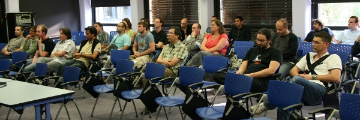](https://picasaweb.google.com/stephane.epardaud/Vendredi6Mai2011SophiaAntipolisSoireeEnversEtTorqueBox)
</td>
</tr>
<tr>
<td>11/03/2011</td><td>[soirée files de messages](Main.201103-files-messages)</td>
</tr>
<tr>
<td colspan="2">
[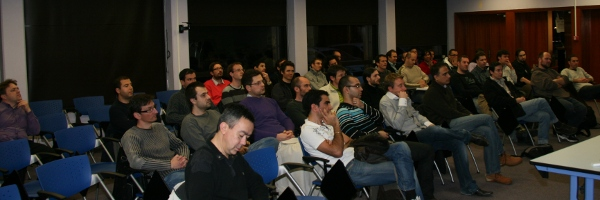](https://picasaweb.google.com/stephane.epardaud/Vendredi11Mars2011SophiaAntipolisSoireeFilesDeMessages)
</td>
</tr>
<tr>
<td>18/02/2011</td><td>[Soirée full-text search](Main.201102-full-text-search)</td>
</tr>
<tr>
<td colspan="2">
[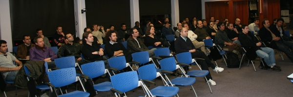](https://picasaweb.google.com/stephane.epardaud/Vendredi18Fevrier2011SophiaAntipolisSoireeFullTextSearch)
</td>
</tr>
<tr>
<td>06/01/2011</td><td>[Soirée outils de productivité](Main.201101-outils)</td>
</tr>
<tr>
<td colspan="2">
[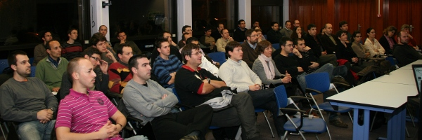](http://picasaweb.google.com/stephane.epardaud/Jeudi6Janvier2011SophiaAntipolisSoireeOutilsDeProductivite)
</td>
</tr>
<tr>
<td>29/11/2010</td><td>[Soirée Netbeans](Main.201012-netbeans)</td>
</tr>
<tr>
<td colspan="2">
[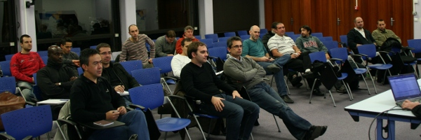](http://picasaweb.google.com/stephane.epardaud/Lundi29Novembre2010SophiaAntipolisSoireeNetBeans)
</td>
</tr>
<tr>
<td>24/11/2010</td><td>[Soirée Cloud](Main.201011-cloud)</td>
</tr>
<tr>
<td colspan="2">
[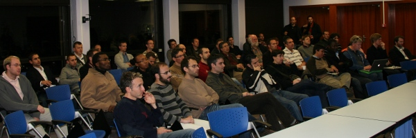](http://picasaweb.google.com/stephane.epardaud/Mercredi24Novembre2010SophiaAntipolisSoireeNuagesCloud)
</td>
</tr>
<tr>
<td>09/07/2010</td><td>[SophiaConf 2010](http://www.sophiaconf2010.fr/programme/vendredi-9-juillet.html)</td>
</tr>
<tr>
<td colspan="2">

</td>
</tr>
<tr>
<td>22/05/2010</td><td>[Soirée BPM](Main.201006-bpm)</td>
</tr>
<tr>
<td colspan="2">
[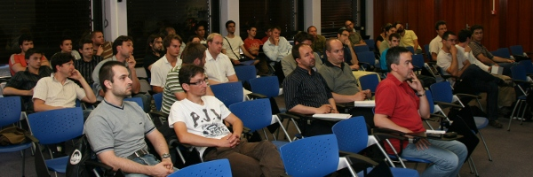](http://picasaweb.google.co.uk/stephane.epardaud/Mardi22Juin2010SophiaAntipolisSoireeBPM)
</td>
</tr>
<tr>
<td>28/05/2010</td><td>[Soirée cloud et coups de cœurs](Main.201005-cloud)</td>
</tr>
<tr>
<td colspan="2">
[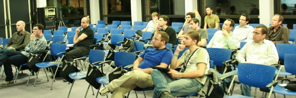](http://picasaweb.google.co.uk/stephane.epardaud/Vendredi28Mai2010SophiaAntipolisSoireeCloudEtCoupsDeCUrs)
</td>
</tr>
<tr>
<td>20/04/2010</td><td>[Soirée build](Main.201004-build)</td>
</tr>
<tr>
<td colspan="2">
[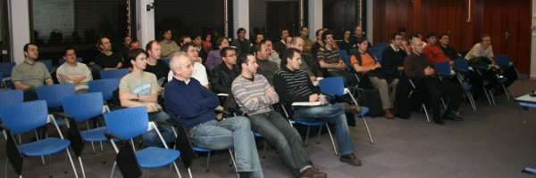](http://picasaweb.google.co.uk/stephane.epardaud/Mardi20Avril2010SophiaAntipolisSoireeOutilsDeBuild)
</td>
</tr>
<tr>
<td>18/03/2010</td><td>[Soirée RESTful](Main.201003-restful)</td>
</tr>
<tr>
<td colspan="2">
[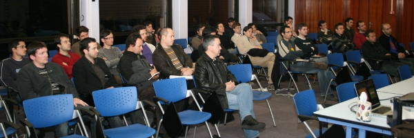](http://picasaweb.google.co.uk/stephane.epardaud/Jeudi18Mars2010SophiaAntipolisSoireeRESTful)
</td>
</tr>
<tr>
<td>05/02/2010</td><td>[Soirée Technologies Google](Main.201002-google)</td>
</tr>
<tr>
<td colspan="2">
[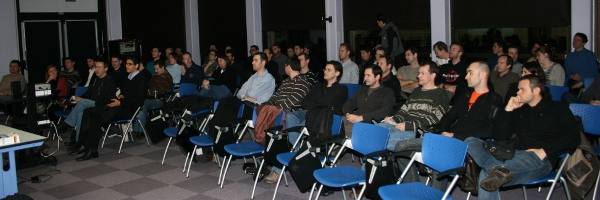](http://picasaweb.google.com/stephane.epardaud/Vendredi5Fevrier2010SophiaAntipolisSoireeTechnologiesGoogle)
</td>
</tr>
<tr>
<td>09/12/2009</td><td>[Soirée Intégration Continue](Main.20091209-integration-continue)</td>
</tr>
<tr>
<td colspan="2">
[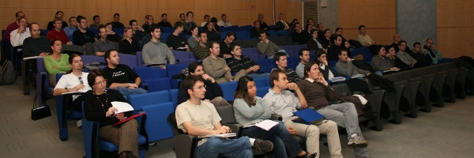](http://picasaweb.google.com/stephane.epardaud/Mercredi9Decembre2009SophiaAntipolisSoireeIntegrationContinue)
</td>
</tr>
<tr>
<td>06/11/2009</td><td>[Soirée Programmation Distribuée](Main.20091106-distributed-computing)</td>
</tr>
<tr>
<td colspan="2">
[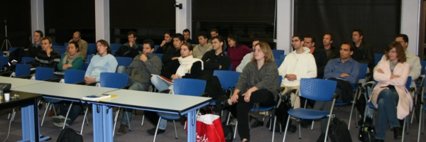](http://picasaweb.google.com/stephane.epardaud/Vendredi6Novembre2009SophiaAntipolisSoireeProgrammationDistribuee)
</td>
</tr>
<tr>
<td>02/10/2009</td><td>[Sophia fait sa Java](Main.20091002)</td>
</tr>
<tr>
<td colspan="2">
[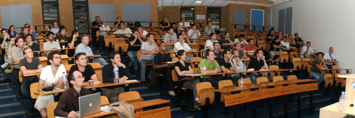](http://picasaweb.google.com/stephane.epardaud/2Octobre2009SophiaAntipolisSophiaFaitSaJava)
</td>
</tr><tr>
<td>19/06/2009</td><td>[Soirée Agile](Main.200907XX)</td>
</tr>
<tr>
<td colspan="2">
[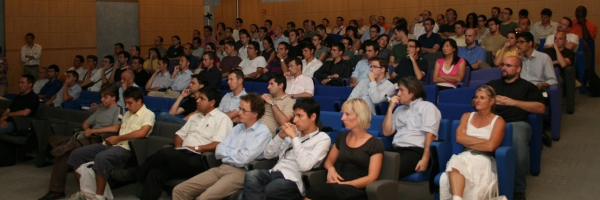](http://picasaweb.google.com/stephane.epardaud/15Juillet2009SophiaAntipolisSoireeAgile)
</td>
</tr>
<tr>
<td>19/06/2009</td><td>[Soirée RIA](Main.20090619-ria)</td>
</tr>
<tr>
<td colspan="2">
[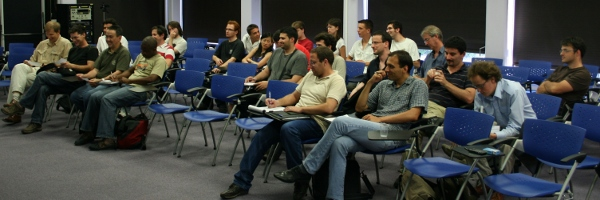](http://picasaweb.google.com/stephane.epardaud/19Juin2009SophiaAntipolisSoireeRIA?feat=directlink)
</td>
</tr>
<tr>
<td>10/04/2009</td><td>[Soirée SOA](Main.20090410-soa)</td>
</tr>
<tr>
<td colspan="2">

</td>
</tr>
<tr>
<td>14/01/2009</td><td>[Mini-conf Java EE](Main.20090114-jug-miniconf)</td>
</tr>
<tr>
<td colspan="2">
[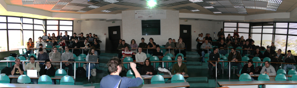](http://picasaweb.google.com/stephane.epardaud/RivieraJUG14Janvier2009SophiaAntipolisMiniConfRenceJavaEE?feat=directlink)
</td>
</tr>
</table>

