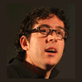

# 10 avril 2009 @ Sophia-Antipolis : soirée SOA

Le Riviera JUG organise sa deuxième rencontre *gratuite* sur le thème [Service Oriented Architecture (SOA)](http://fr.wikipedia.org/wiki/Architecture_orient%C3%A9e_services) le vendredi 10 avril 2009 sur le site de [Stonesoft](http://www.stonesoft.fr) à Sophia-Antipolis ([localiser sur google street view](http://maps.google.fr/maps?f=q&source=s_q&hl=fr&geocode=&q=Stonesoft+France,+7+rue+Soutrane,+06560+SOPHIA+ANTIPOLIS&sll=43.624147,7.047493&sspn=0.009584,0.027895&ie=UTF8&ll=43.623603,7.047493&spn=0,359.972105&t=h&z=16&iwloc=A&layer=c&cbll=43.62356,7.047388&panoid=OBQExSEJc5rXZVkgSUrnDA&cbp=12,269.44251938871946,,0,7.907692307692307)).

Qu’est-ce qu’un [Enterprise Service Bus (ESB)](http://fr.wikipedia.org/wiki/Enterprise_Service_Bus) ? Nicolas et Stéphane avaient la discussion suivante (ou proche de) avec Gaël Blondelle à [Devoxx 2008](http://devoxx.com/) :

Stéphane : « Mais c’est quoi en fait un ESB ? » 
Nicolas : « Un ESB c’est facile : c’est un truc où on branche plein d’applis, et elles se parlent par le bus et tout marche automatiquement. » 
Gaël : « Euh… pas tout à fait. Je vous expliquerai un jour : c’est plus compliqué. »

Eh bien voilà l’occasion révée grâce à Gaël Blondelle (CTO de [EBMWebSourcing](http://ebmwebsourcing.com/)) et Christophe Deneux (Architecte à [Capgemini](http://www.fr.capgemini.com/)) d’enfin comprendre par l’exemple de [PEtALS](http://petals.ow2.org/) ce que fait un ESB et pourquoi un ESB « open-source » c’est mieux.

D’autre part nous allons avoir une présentation de [Bonita](http://wiki.bonita.objectweb.org/xwiki/bin/view/Main/WebHome) qui éclairera le rôle que joue le [Business Process Management (BPM)](http://fr.wikipedia.org/wiki/Proc%C3%A9dure_d%27entreprise) dans les application Java.

# Programme

Ce programme est susceptible de changer selon des imprévus prévisibles. Il a d’ailleurs changé

|Horaire|Description|
|---|---|
|18:00 - 18:30|Accueil — café|
|18:30 - 19:30|Présentation de PEtALS (par Christophe Deneux et Gaël Blondelle)|
|19:30 - 20:00|Pause — buffet|
|20:00 - 20:30 |   Eclipse CDO Model Repository (par André Dietisheim) --BPM in easy terms: The PVM and Bonita (par Miguel Valdes Faura)--|
|20:30 - 21:00 |  Riviera JUG news|
|21:00 - 21:30|Fin/Rencontres — buffet|

# Pour venir

Stonesoft France :

[L’Arche des Dolines, 7 rue Soutrane, 06560 SOPHIA ANTIPOLIS.](http://maps.google.fr/maps?f=q&source=s_q&hl=fr&geocode=&q=Stonesoft+France,+7+rue+Soutrane,+06560+SOPHIA+ANTIPOLIS&sll=43.624147,7.047493&sspn=0.009584,0.027895&ie=UTF8&ll=43.623603,7.047493&spn=0,359.972105&t=h&z=16&iwloc=A&layer=c&cbll=43.62356,7.047388&panoid=OBQExSEJc5rXZVkgSUrnDA&cbp=12,269.44251938871946,,0,7.907692307692307)

Taper à la porte ou sonner à l’interphone.

# Réservation

Cette soirée étant la deuxième du Riviera JUG et la première en format soirée, nous espérons que vous viendrez nombreux, mais pas trop nombreux, car la salle prêtée gracieusement et très gentiment accepte un maximum de 30 personnes.

Les premiers 30 pourront s’enregistrer [sur le site de réservation](http://www.lunatech-research.com/event/register/rivierajug-2009-avril), les suivants étant néanmoins enregistrés pour déterminer s’il nous faut une plus grande salle ou non. Dans la mesure ou la demande excéderait grandement la limite des 30 personnes, et dans la mesure où nous trouvons une salle plus grande dans le temps impartit, nous pourrons éventuellement relocaliser la soirée.

Si vous connaissez des salles de conférences (avec projecteur vidéo) sur Sophia-Antipolis pouvant accueillir plus de trente personnes et pouvant être mises à disposition gratuitement au Riviera JUG, [contactez-nous](mailto:info@rivierajug.org).

[Enregistrez-vous vite ici](http://www.lunatech-research.com/event/register/rivierajug-2009-avril).

# Programme détaillé

## PEtALS

Cette présentation se fera en deux parties :

- Présentation de [PEtALS](http://petals.ow2.org) par Gaël Blondelle.
- Retour d’expérience dans le cadre du projet « Interlocuteur Social Unique » à l’ACOSS (Agence Centrale des Organismes de Securité Sociale), par Christophe Deneux.

PEtALS est un ESB Open Source du consortium [OW2](http://www.ow2.org/) supporté par [EBM WebSourcing](http://ebmwebsourcing.com/). PEtALS est le premier ESB à respecter JBI ([Java Business Integration](http://www.javaworld.com/javaworld/jw-07-2006/jw-0717-jbi.html)) et SCA ([Service Component Architecture](http://www.osoa.org/display/Main/Service+Component+Architecture+Home)). PEtALS permet à la fois d’écrire la logique d’intégration avec SCA, et de la déployer dans une infrastructure SOA agile basée sur JBI. PEtALS propose une approche d’architecture SOA largement distribuée qui permet de créer une véritable infrastructure de services pour l’entreprise fiable, scalable et robuste.

Différents cas d’usage de PEtALS seront présentés comme sa mise en place dans le SI d’Orange, ainsi que le cas d’usage de l’infrastructure de services national de l’ACOSS.

## Eclipse EMF / CDO

The Eclipse Modeling Framework enables developers to rapidly construct robust applications based on surprisingly simple models. Now, in this thoroughly revised Second Edition, the project’s developers offer expert guidance, insight, and examples for solving real-world problems with EMF, accelerating development processes, and improving software quality.

This edition contains more than 40% new material, plus updates throughout to make it even more useful and practical. The authors illuminate the key concepts and techniques of EMF modeling, analyze EMF’s most important framework classes and generator patterns, guide you through choosing optimal designs, and introduce powerful framework customizations and programming techniques.

## BPM in easy terms: The PVM and Bonita

This talk will show how developers can benefit from workflow, [Business
Process Management (BPM)|http://fr.wikipedia.org/wiki/Proc%C3%A9dure_d%27entreprise], and orchestration. We'll explain the core essence
of [workflow](http://fr.wikipedia.org/wiki/Workflow) engines in simple terms, and how this can be leveraged in a Java
environment. We will also introduce a revolutionary open source technology
called [The Process Virtual Machine](http://www.onjava.com/pub/a/onjava/2007/05/07/the-process-virtual-machine.html) and the first [BPM](http://fr.wikipedia.org/wiki/Proc%C3%A9dure_d%27entreprise) solution build on top: [The Bonita Open Source Project](http://bonita.objectweb.org/).

# À propos des intervenants

## Gaël Blondelle

Gaël Blondelle is founder and CTO of [EBM WebSourcing](http://ebmwebsourcing.com/). Gaël is also Chairman of the [OW2](http://www.ow2.org/) Technology Council. Gaël is the founder of [PETALS](http://ebmwebsourcing.com/produits/petals.html), the open source JBI compliant ESB hosted by OW2.

Gaël has more than 12 year of experience in IT, both for large companies like Alcatel and France Telecom, or as consultant and trainer for Valtech.

## Christophe Deneux

Christophe Deneux is an integration architect at [Capgemini Sud](http://www.fr.capgemini.com/) (Nice, France). He joined the group in 1997 and developed through various missions a control of software architectures and application integrations in the Java world, as well as an expertise of methodology and developments industrialisation.

## André Dietisheim

André is a commiter for the Eclipse foundation on CDO and Net4j, subprojects of EMF. He currently develops a configuration framework (Defs). He is also the Eclipse development lead at [Puzzle ITC ]( http://www.puzzle.ch).

## Miguel Valdes Faura

Miguel was born in the cosmopolitan city of Barcelona and he is now living
and working in France. He is the [BPM](http://fr.wikipedia.org/wiki/Proc%C3%A9dure_d%27entreprise) Manager working for [Bull R&D](http://www.bull.com/) and he is
member of the [OW2](http://www.ow2.org/) Technical Council. Previously, in 2001, he joined [INRIA](http://www.inria.fr),
the French Research Institute in Computer Sciences, co-founding the [Bonita
Workflow System|http://wiki.bonita.objectweb.org/xwiki/bin/view/Main/WebHome].
During the last years has been working around the world on open source [BPM](http://fr.wikipedia.org/wiki/Proc%C3%A9dure_d%27entreprise)
and workflow deployments for private and public companies.

He is a regular speaker at international conferences : [JavaOne](http://java.sun.com/javaone/), [Internet Global Congress](http://www.igcweb.net/), [Open Source World Conference](http://www.opensourceworldconference.com/), [javaHispano Conference](http://www.javahispano.org/),
[ObjectWebCon](http://www.objectweb.org/), [COSGov](http://www.cosgov.org/), [JavaBin](http://www.java.no/).

