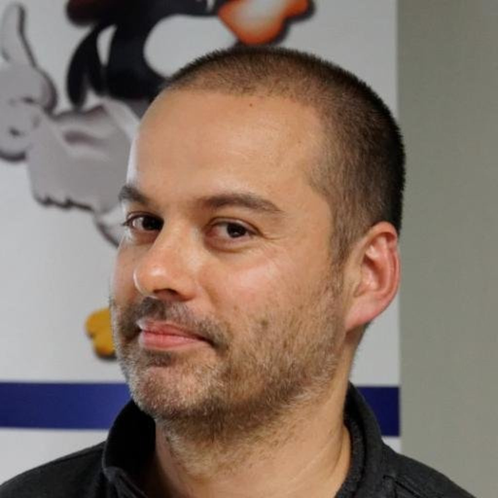

# Mardi 20 mars 2018 @ Sophia-Antipolis : soirée Kafka

Le Riviera JUG organise une rencontre **gratuite** sur le thème de Kafka le mardi 20 mars 2018 à partir de 18h dans les locaux d’[Inria Sophia-Antipolis](http://maps.google.fr/maps?f=q&source=s_q&hl=en&geocode=&q=inria,+sophia-antipolis&sll=47.15984,2.988281&sspn=20.81297,46.757813&ie=UTF8&t=h&ll=43.616722,7.067868&spn=0.005406,0.011415&z=17&iwloc=A).

Avant les message brokers c'était simple on bourrait des messages dans un bout du tuyau et ça ressortait par d'autres tuyaux pour alimenter vos applications, et Kafka c'était pareil sauf que ça passait mieux à l'échelle. Mais depuis quelques temps Kafka a ajouté les streams, le KSQL, Connect et on est un peu perdu dans tout ça. Heureusement pour nous, Florent Ramière qui travaille tous les jours au cœur de la bête va venir nous expliquer à quoi ça sert tout ça.

Ne manquez pas cette soirée :)

# Réservation

# Programme

Ce programme est susceptible de changer selon des imprévus prévisibles.

|Horaire|Description|
|---|---|
|18:00 - 18:30|Accueil|
|18:30 - 19:15|[Au delà des brokers : un tour de l'environnement Kafka](#HProgrammedE9taillE9)|
|19:15 - 19:45|Buffet, boissons|
|19:45 - 20:30|[Au delà des brokers : un tour de l'environnement Kafka](#HProgrammedE9taillE9)|

# Sponsors

|Sponsor|Rôles|
|---|---|
|[.image('inria-2-150px.png')})](http://www.inria.fr/sophia)  | Salle|

# Pour venir

Salle « Euler Violet », bâtiment Euler en face du poste de garde (le gardien vous l’indiquera quand vous arriverez sur le site).

INRIA Sophia-Antipolis
2004, route des Lucioles
06902 Sophia Antipolis

[Plan d’accès](http://www-sop.inria.fr/presentation/data/plan_sophia.jpg).

Prevoyez une pièce d’identité pour le poste de garde.

<iframe src="https://www.google.com/maps/embed?pb=!1m17!1m11!1m3!1d12898.164001627882!2d7.061702203010714!3d43.61600471568019!2m2!1f0!2f0!3m2!1i1024!2i768!4f13.1!3m3!1m2!1s0x0%3A0xe656aec13e1ef9b1!2sInria+Sophia+Antipolis+Mediterranean!5e1!3m2!1sen!2sfr!4v1496239060604" width="600" height="450" frameborder="0" style="border:0" allowfullscreen></iframe>

# Programme détaillé

## Au delà des brokers : un tour de l'environnement Kafka

Apache Kafka ne se résume pas aux brokers, il y a tout un écosystème open-source qui gravite autour.
Je vous propose ainsi de découvrir les principaux composants comme Kafka Streams, KSQL, Kafka Connect, Rest proxy, Schema Registry, MirrorMaker, Interceptors, etc.

# À propos des intervenants

## Florent Ramière

Florent Ramière a plus de vingt années d'expérience dans le développement logiciel et la conduite de projets informatiques. Il a passé plusieurs années aux Etats-Unis chez un éditeur de logiciel. A son retour en France après un détour chez Capgemini, il a co-fondé la société Jaxio. Après plus de 10 ans d'entreprenariat, Florent a rejoint la société Confluent, la société derrière Apache Kafka où il accompagne les grands comptes en Europe.
