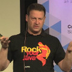

# Jeudi 13 septembre 2018 @ Sophia-Antipolis : soirée releases et perfs JVM

Le Riviera JUG organise une rencontre **gratuite** sur le thème des releases et perfs JVM le jeudi 13 septembre 2018 à partir de 18h dans les locaux d’[Inria Sophia-Antipolis](http://maps.google.fr/maps?f=q&source=s_q&hl=en&geocode=&q=inria,+sophia-antipolis&sll=47.15984,2.988281&sspn=20.81297,46.757813&ie=UTF8&t=h&ll=43.616722,7.067868&spn=0.005406,0.011415&z=17&iwloc=A).

Le Riviera JUG fait sa rentrée sur les chapeaux de roues et organise une rencontre avec Gil Tene, co-fondateur d'Azul Systems et co-créateur de la JVM Zing (entre plein d'autres), en personne !  Gil va tout d'abord clarifier les récents chamboulements concernant le rythme de publication des nouvelles versions du JDK et leur cycle de vie, et démystifier l'écosystème des JVMs, suite notamment à la toute nouvelle approche commerciale d'Oracle.  Puis, en seconde partie, il nous expliquera comment les JVMs produisent à la volée du code qui pootre et tire partie des dernières améliorations de nos chers processeurs.

[Ça a des chapeaux, les roues ?]

[Ah, ouais, ce sont les enjoliveurs…]

Ne manquez pas cette soirée :)

# Réservation

# Programme

Ce programme est susceptible de changer selon des imprévus prévisibles.

|Horaire|Description|
|---|---|
|18:00 - 18:30|Accueil|
|18:30 - 19:00|[Java: Get ready for an exciting but stormy 2019](#HProgrammedE9taillE9)|
|19:00 - 19:30|Buffet, boissons|
|19:30 - 20:30|[Java at Speed: Get the Most out of Modern Hardware](#HProgrammedE9taillE9)|

# Sponsors

|Sponsor|Rôles|
|---|---|
|[.image('inria-2-150px.png')})](http://www.inria.fr/sophia)  | Salle|

# Pour venir

Salle « Euler Violet », bâtiment Euler en face du poste de garde (le gardien vous l’indiquera quand vous arriverez sur le site).

INRIA Sophia-Antipolis
2004, route des Lucioles
06902 Sophia Antipolis

[Plan d’accès](http://www-sop.inria.fr/presentation/data/plan_sophia.jpg).

Prevoyez une pièce d’identité pour le poste de garde.

<iframe src="https://www.google.com/maps/embed?pb=!1m17!1m11!1m3!1d12898.164001627882!2d7.061702203010714!3d43.61600471568019!2m2!1f0!2f0!3m2!1i1024!2i768!4f13.1!3m3!1m2!1s0x0%3A0xe656aec13e1ef9b1!2sInria+Sophia+Antipolis+Mediterranean!5e1!3m2!1sen!2sfr!4v1496239060604" width="600" height="450" frameborder="0" style="border:0" allowfullscreen></iframe>

# Programme détaillé

## Java: Get ready for an exciting but stormy 2019

The Java world is in the midst of tectonic shift. With dramatic changes to the pace of feature introduction, release lifecycles, compatibility policies, security update policies, and the required pace of adoption in production all happening at the same time, the world ahead will look nothing like what you may have gotten used to. In the short talk, Gil Tene (CTO, Azul Systems) will provide a quick overview of what developers and operational people need to know if Java is part of their world.

## Java at Speed: Get the Most out of Modern Hardware

Getting the most of your Java applications can be an interesting challenge. Understanding some of the optimizations the latest crop of JVMs are able to apply when running on the latest servers may help with that. This talk will discuss some of those features and optimizations. Along with discussing some JIT compiler capabilities, we will take a look at the evolution of Intel-based server platforms, quickly traversing through features that were introduced over the past few years. We will demonstrate some examples of JVM JITs using these capabilities where available, as they adapt the code they generate to the specific processors they run on.

If you like to geek out to the sound of mechanical sympathy discussions, this is the talk for you.

# À propos des intervenants

## Gil Tene

Gil Tene is CTO and co-founder of Azul Systems. He has been involved with virtual machine and runtime technologies for the past 25 years. His pet focus areas include system responsiveness and latency behavior. Gil is a frequent speaker at technology conferences worldwide, and an official JavaOne Rock Star. He pioneered the Continuously Concurrent Compacting Collector (C4) that powers Azul's continuously reactive Java platforms. In past lives, he also designed and built operating systems, network switches, firewalls, and laser based mosquito interception systems.
