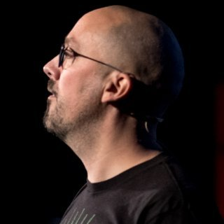

# Mercredi 4 mars 2020 @ Sophia-Antipolis : soirée Gradle

Le Riviera JUG organise une rencontre **gratuite** sur le thème de Gradle le mercredi 4 mars 2020 à partir de 18h dans les locaux d’[Inria Sophia-Antipolis](http://maps.google.fr/maps?f=q&source=s_q&hl=en&geocode=&q=inria,+sophia-antipolis&sll=47.15984,2.988281&sspn=20.81297,46.757813&ie=UTF8&t=h&ll=43.616722,7.067868&spn=0.005406,0.011415&z=17&iwloc=A).

Les espaces ou les tabulations, les pointeurs ou le GC, Eclipse ou IntelliJ, Pain au chocolat ou Chocolatine : vous savez qu’au JUG on adore les débats objectifs sur les sujets facile à trancher.

Alors du coup, on va parler d’outil de build, et en particuler de [Gradle](https://gradle.org), grâce à Cédric Champeau, dont il est un des principaux développeurs. Il nous parlera de la nouvelle version de Gradle et de pourquoi ça poutre et pourquoi quitter les outils de build de nos grand-mères comme Maven, Ant et Make. En toute objectivité :)

Ne manquez pas cette soirée :)

# Réservation

<!<s> Noscript content for added SEO </s>>
<noscript><a href="https://www.eventbrite.com/e/mercredi-4-mars-2020-sophia-antipolis-soiree-gradle-tickets-94375374285" rel="noopener noreferrer" target="_blank"></noscript>
<!<s> You can customize this button any way you like </s>>
<button id="eventbrite-widget-modal-trigger-94375374285" type="button">Reserve Tickets</button>
<noscript></a>Reserve Tickets on Eventbrite</noscript>

# Programme

Ce programme est susceptible de changer selon des imprévus prévisibles.

|Horaire|Description|
|---|---|
|18:00 - 18:30|Accueil|
|18:30 - 19:00|[Pourquoi passer à Gradle 6 ?](#HProgrammedE9taillE9)|
|19:00 - 19:30|Buffet, boissons|
|19:30 - 20:30|[Pourquoi passer à Gradle 6 ?](#HProgrammedE9taillE9)|

# Sponsors

|Sponsor|Rôles|
|---|---|
|[.image('inria-2-150px.png')})](http://www.inria.fr/sophia)  | Salle|

# Pour venir

Salle « Euler Violet », bâtiment Euler en face du poste de garde (le gardien vous l’indiquera quand vous arriverez sur le site).

INRIA Sophia-Antipolis
2004, route des Lucioles
06902 Sophia Antipolis

[Plan d’accès](http://www-sop.inria.fr/presentation/data/plan_sophia.jpg).

Prevoyez une pièce d’identité pour le poste de garde.

<iframe src="https://www.google.com/maps/embed?pb=!1m17!1m11!1m3!1d12898.164001627882!2d7.061702203010714!3d43.61600471568019!2m2!1f0!2f0!3m2!1i1024!2i768!4f13.1!3m3!1m2!1s0x0%3A0xe656aec13e1ef9b1!2sInria+Sophia+Antipolis+Mediterranean!5e1!3m2!1sen!2sfr!4v1496239060604" width="600" height="450" frameborder="0" style="border:0" allowfullscreen></iframe>

# Programme détaillé

## Pourquoi passer à Gradle 6 ?

Gradle 6 est la culmination de plusieurs années d'innovations dans le domaine de la gestion de dépendances.
Cette version reconnaît le fait que la composition logicielle dépasse le simple fait d'ajouter des _jar_ sur le classpath: Gradle offre maintenant un nouveau format de métadonnées qui permet de modéliser finement des composants logiciels souvent construits autour de plusieurs fichiers, offrant plusieurs variantes et des contraintes différentes sur leurs dépendances.

Gradle 6 ajoute aussi de nombreuses fonctionnalités destinées à améliorer la productivité des développeurs, en particulier une mise à jour de la Worker API et de la Tooling API: destinées principalement aux développeurs de plugins, ces fonctionnalités sont cruciales pour réduire vos temps de builds.

Nous aborderons:

- les nouveautés en gestion de dépendances
- les améliorations des toolchains Java, Groovy et Scala
- les améliorations pour les auteurs de plugins

# À propos des intervenants

## Cédric Champeau

Amoureux de l'Open Source, Cédric Champeau travaille chez Gradle Inc. où il développe l'outil de build open-source du même nom. Il a notamment contribué à l'amélioration des performances et travaille désormais sur la problématique de gestion de dépendances.

Auparavant, Cédric a été committer sur Apache Groovy: il a implémenté le compilateur statique de ce langage et contribué sur le sujet des DSLs et transformations à compile time.
