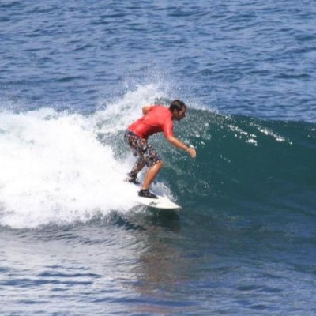

# Mardi 6 décembre 2022 @ Sophia-Antipolis : soirée Renarde et Quinoa

Le Riviera JUG organise une rencontre **gratuite** sur le thème de Quarkus Renarde et Quinoa le lundi 21 novembre 2022 à partir de 18h dans les locaux de [Amadeus Sophia Antipolis](url:https://goo.gl/maps/agQMwmE74eWqqQvd8).
**Vous pouvez entrer sur le site d'Amadeus avec votre véhicule et vous garer à 2 pas (si vous avez de grandes jambes) de l'amphi où aura lieu la soirée !**

Nous commencerons par un petit tour de la forêt (les principes fondamentaux de Quarkus, ce framework dont tout le monde parle).

A partir de là, nous allons suivre un renard (Stéphane) dans son terrier. Nous y trouverons (sa) Renarde (l'extension Quarkus Renarde) dont il nous fera une chaleureuse présentation. Celle-ci est connue pour nous mijoter de bons plats d'antan avec des notes d'aujourd'hui (des applications web en mode MVC serveur en supersonique subatomique).

Piqué au vif par cette savoureuse préparation, le renard de la forêt voisine (Andy) essaiera tant bien que mal de montrer que le Quinoa (l'extension Quarkus Quinoa) est très bon pour la santé et que ça permet en plus de faire des plats modernes et savoureux (SPA supersonique subatomique).

Les deux renards affûtés se rendent enfin compte que c'est ensemble qu'ils allaient faire les meilleurs plats (le futur de Quarkus avec htmx) !

Ne manquez pas cette soirée et faites tourner l'info !  :)

# Réservation

# Programme

Ce programme est susceptible de changer selon des imprévus prévisibles.

|Horaire|Description|
|---|---|
|18:00 - 18:30|Accueil|
|18:30 - 19:30|Premier talk|
|19:30 - 20:00|Buffet, boissons|
|20:00 - 21:00|Deuxième talk|
|21:00|(((|
Troisième mi-temps dans un resto quelque part !
)))

# Sponsors

|Sponsor|Rôles|
|---|---|
|[.image('amadeus.png')})](https://amadeus.com/fr)  | Salle|

# Pour venir

Amadeus, main site, Mistral auditorium
485 Rte du Pin Montard
06410 Biot

Garez-vous à l'intérieur du site !

[Plan d’accès](https://goo.gl/maps/agQMwmE74eWqqQvd8)

<iframe src="https://www.google.com/maps/embed?pb=!1m18!1m12!1m3!1d2334.61087379998!2d7.057556422906037!3d43.62195443006717!2m3!1f0!2f0!3f0!3m2!1i1024!2i768!4f13.1!3m3!1m2!1s0x12cc2b7cba432085%3A0xcb5e30e756ebb5c5!2sAmadeus%20Main%20Site!5e0!3m2!1sen!2sfr!4v1648131547103!5m2!1sen!2sfr" width="600" height="450" style="border:0;" allowfullscreen="" loading="lazy"></iframe>

# Detailed program

## Quarkus Renarde 🦊♥ : un framework Web old-school au goût du jour

Quarkus Renarde 🦊♥ est un nouveau framework Web basé sur Quarkus. Cette fois on ne fait plus de micro-services, mais une application Web en rendant Quarkus encore plus facile à utiliser pour ça :

- Endpoints basés sur la convention, encore plus facile que RESTEasy Reactive et JAX-RS
- Templating (server-side) avec Qute
- Validation avec Hibernate Validation
- Données avec Hibernate ORM ou Reactive with Panache
- Authentication avec Open ID Connect ou Webauthn les doigts dans le nez
- Et tout ça en gardant le plaisir de développer avec Quarkus (live reload, continuous testing, DEV UI, etc…)

Nous vous montrerons toutes ces features renardement au travers d'une application exemple, mais complète : un Todo avec utilisateurs, registration/login/OIDC/Webauthn, validation, emails, etc…

## Quarkus Quinoa

Quinoa extension takes care of all the Web UI build/wiring/dev-mode hassles so you can concentrate on your web application logic (back-end and front-end).

Together, let’s look at how easy it is to spin up a basic full-stack application with Quarkus. That done, we can go deeper and code a new feature in a more complex demo app, a car racing game with Quarkus, Quinoa, React, Kafka & Infinispan. Quinoa will be the glue between the back and the front end to make it work seamlessly from dev to production on OpenShift. Are you ready to play the game?

# About the speaker

## Stephane Epardaud

Depuis les hautes montagnes de Nice, Stéphane travaille pour Red Hat sur le project Vert.x et Quarkus.

Hacker passionné de Java, C, Perl ou Scheme. Versé dans les standards web et des bases de données, il a travaillé sur divers projets tel qu'un éditeur XML WYSIWYG, une libraire de multi-threading en C, un language pour agents mobiles en Scheme (compilateur et machines virtuelles), ainsi que des services web 2.0 RESTful et des interfaces web riches en HTML 5 / Javascript.

Avide de partage de connaissance, il va souvent parler dans des conférences tels que Scheme Workshop, l´Université de Nice, Devoxx, JavaOne, JavaZone, JAX, de nombreux Java User Groups, dont le Riviera Java User Group qu'il anime conjointement. Acteur passionné de l´open source depuis le début, il a contribué au projet Ceylon, RESTEasy et crée les projets Redpipe, Reactive Contexts, jax-doclets, stamps.js ainsi quelques modules de Play! Framework. Il est également co-créateur de la conférence Riviera DEV.

Il travaille maintenant à temps plein sur les projets Vert.x et Quarkus pour Red Hat.

## Andy Damevin

Andy développe à Red Hat en tant que Principal Software Engineer. Il fait partie de l’équipe Quarkus, qu’il considère comme l’un des projets Java open source les plus excitants du moment. Quarkus est une stack Kubernetes Native taillé pour OpenJDK HotSpot & GraalVM, fabriqué à partir des meilleurs libraires et standards Java.

Andy se concentre principalement sur les “devtools” dont le but est d’apporter une super expérience de dev sur Quarkus et son large ecosystem d’extensions. La fameuse “Developer Joy”.

On le connaît pour avoir créé https://code.quarkus.io (permet de bootstraper un projet Quarkus en quelques clics) ainsi que l'extension Quarkus Quinoa (faire de l’UI en mode SPA avec Quarkus).

L'expérience d’Andy est principalement Java, même s' il aime aussi jouer avec du frontend quand c’est possible sur React par exemple.

Je travaillais précédemment sur un outil permettant de créer/lancer des applications sur OpenShift et Kubernetes, je suis donc familier avec l'environnement.

J'ai aussi quelques notions sur le monitoring ayant travaillé sur un logiciel de test de performance et de monitoring.
