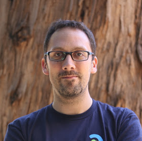

# Mardi 14 mars 2023 @ Sophia-Antipolis :  soirée Micronaut

Reporté

<s>Le Riviera JUG organise une rencontre **gratuite** sur le thème de Micronaut le mardi 14 mars 2013 à partir de 18h dans les locaux de [Amadeus Sophia Antipolis](url:https://goo.gl/maps/agQMwmE74eWqqQvd8).</s>

<s>Cette soirée sera entièrement présentée par [Cédric Champeau](https://twitter.com/CedricChampeau), d'Oracle Labs.</s>

<s>"Tu peux pas test", vous aussi vous en avez marre d'entendre ce refrain, n'est-ce pas ? Trop souvent, face aux difficultés de tester son code correctement, on renonce, et on finit par (╯°□°)╯︵ ┻━┻. Eh bien Cédric n'est pas de ceux qui renoncent, et il viendra nous expliquer, après une introduction à Micronaut, qu'au lieu de désespérer, on peut donc se tourner vers Micronaut et tester facilement son code, parce que c'est lui qui s'est décarcassé en amont pour vous faciliter la vie. Elle est pas belle, justement, la vie ?</s>

<s>[-> Programme détaillé](#DetailedProgram)</s>

<s>Notez que vous pouvez entrer sur le site d'Amadeus avec votre véhicule et vous garer à 2 pas (si vous avez de grandes jambes) de l'amphi où aura lieu la soirée !</s>

<s>Ne manquez pas cette soirée !  :)</s>

# Réservation

# Programme

Ce programme est susceptible de changer selon des imprévus prévisibles.

|Horaire|Description|
|---|---|
|18:00 - 18:30|Accueil|
|18:30 - 19:30|Premier talk :  Introduction à Micronaut|
|19:30 - 20:00|Buffet, boissons|
|20:00 - 21:00|Deuxième talk :  Tester vos microservices sans peine avec Micronaut Test Resources|
|21:00|Troisième mi-temps dans un resto quelque part !|

# Sponsors

|Sponsor|Rôles|
|---|---|
|[.image('amadeus.png')})](https://amadeus.com/fr)  | Salle|

# Pour venir

Amadeus, main site, Mistral auditorium
485 Rte du Pin Montard
06410 Biot

Garez-vous à l'intérieur du site !

[Plan d’accès](https://goo.gl/maps/agQMwmE74eWqqQvd8)

<iframe src="https://www.google.com/maps/embed?pb=!1m18!1m12!1m3!1d2334.61087379998!2d7.057556422906037!3d43.62195443006717!2m3!1f0!2f0!3f0!3m2!1i1024!2i768!4f13.1!3m3!1m2!1s0x12cc2b7cba432085%3A0xcb5e30e756ebb5c5!2sAmadeus%20Main%20Site!5e0!3m2!1sen!2sfr!4v1648131547103!5m2!1sen!2sfr" width="600" height="450" style="border:0;" allowfullscreen="" loading="lazy"></iframe>

# <a name='DetailedProgram'/>Programme détaillé

Micronaut est un framework full-stack moderne, basé sur la JVM, permettant de construire des microservices ou applications serverless facilement.
De par son emphase sur la compilation ahead-of-time, il s'intègre particulièrement bien avec GraalVM, poussant les limites de ce qu'on peut faire avec le langage Java.
Dans cette présentation, nous commencerons par présenter Micronaut : aucun pré-requis préalable, nous le ferons en douceur !

Nous aborderons ensuite le sujet des tests :  le développement d'applications modernes est aussi synonyme de multiples intégrations qui sont parfois difficiles à configurer. Par exemple, votre application peut avoir besoin d'une base de données, d'un serveur Kafka, d'un broker MQTT ou autre. Micronaut Test Resources permet de grandement simplifier le développement de telles applications: sans aucune configuration, il est capable de démarrer des conteneurs de test pendant le développement ou les tests, réduisant considérablement l'effort nécessaire pour obtenir une excellente productivité développeur. Dans cette session, nous montrerons les bases d'une application Micronaut et comment il s'intègre, en particulier, avec les outils de builds et Testcontainers.
Micronaut Test Resources est aussi un framework extensible, rendant relativement simple l'ajout de vos propres ressources de test: il est par exemple possible d'exposer un conteneur Docker avec quelques lignes de configuration. En dernier recours, il est toujours possible d'implémenter vos propres ressources de test.
Enfin, il est intéressant de savoir que Micronaut Test Resources est conçu de façon à ce que les ressources de test puissent être partagées entre différents projets, même s'ils utilisent des outils de build différent !
Cerise sur le gâteau, nous montrerons comment les images natives peuvent bénéficier de ce mécanisme.

# À propos du speaker

## [Cédric Champeau](https://twitter.com/CedricChampeau)

Cédric Champeau travaille pour Oracle Labs, dans l'équipe GraalVM et plus particulièrement sur le framework Micronaut.
Il s'est spécialisé dans le domaine de la productivité développeur et maintient les plugins officiels de GraalVM et Micronaut pour Gradle et Maven. Il a travaillé plusieurs années dans le domaine de la gestion de dépendances et de la productivité développeur chez Gradle Inc.
Ancien contributeur sur le langauge Groovy, il a notamment implémenté son compilateur statique.
En dehors du travail, Cédric est un passionné d'astronomie.
