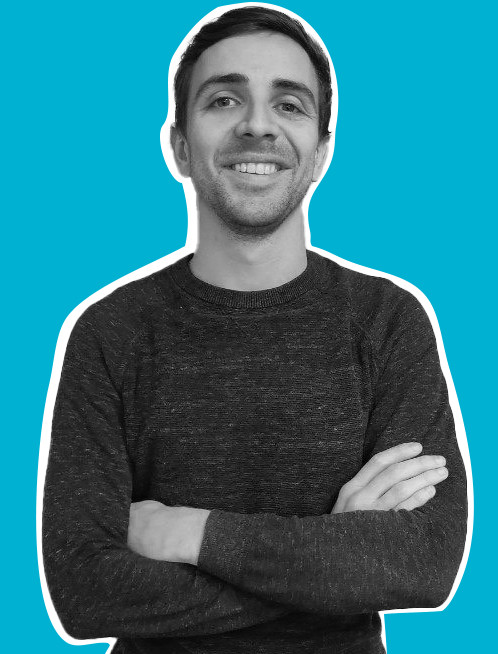

# Lundi 26 juin 2023 @ Sophia-Antipolis :  soirée DevOps

Le Riviera JUG organise une rencontre **gratuite** sur le thème de DevOps le lundi 26 juin 2023 à partir de 18h dans les locaux de [Amadeus Sophia Antipolis](url:https://goo.gl/maps/agQMwmE74eWqqQvd8).
**Vous pouvez entrer sur le site d'Amadeus avec votre véhicule et vous garer à 2 pas (si vous avez de grandes jambes) de l'amphi où aura lieu la soirée !**

Si comme moi, vos collègues vous bassinent pour faire une soirée sur le DevOps mais vous ne savez même pas de quoi ça parle, ou si c'est juste une façon bucolique de prononcer le nom de la conférence du (presque) même nom, alors cette soirée est faite pour vous ! Et moi ! Enfin, j'en sais rien, en fait, mais les collègues en question n'ont pas su me répondre quand j'ai demandé de quoi ça parlait, alors je vais être obligé d'y aller pour voir 🤷. Venez, on se sentira moins seuls, ensemble !

Ne manquez pas cette soirée et faites tourner l'info !  :)

# Réservation

# Programme

Ce programme est susceptible de changer selon des imprévus prévisibles.

|Horaire|Description|
|---|---|
|18:00 - 18:30|Accueil|
|18:30 - 19:30|Premier talk|
|19:30 - 20:00|Buffet, boissons|
|20:00 - 21:00|Deuxième talk|
|21:00|Troisième mi-temps dans un resto quelque part !|

# Sponsors

|Sponsor|Rôles|
|---|---|
|[.image('amadeus.png')})](https://amadeus.com/fr)  | Salle|

# Pour venir

Amadeus, main site, Mistral auditorium
485 Rte du Pin Montard
06410 Biot

Garez-vous à l'intérieur du site !

[Plan d’accès](https://goo.gl/maps/agQMwmE74eWqqQvd8)

<iframe src="https://www.google.com/maps/embed?pb=!1m18!1m12!1m3!1d2334.61087379998!2d7.057556422906037!3d43.62195443006717!2m3!1f0!2f0!3f0!3m2!1i1024!2i768!4f13.1!3m3!1m2!1s0x12cc2b7cba432085%3A0xcb5e30e756ebb5c5!2sAmadeus%20Main%20Site!5e0!3m2!1sen!2sfr!4v1648131547103!5m2!1sen!2sfr" width="600" height="450" style="border:0;" allowfullscreen="" loading="lazy"></iframe>

# Detailed program

## R2devops

Ce n’est un secret pour personne : la CI/CD est devenue un incontournable pour assurer une bonne expérience de développement. Pourtant, elle repousse encore beaucoup de développeurs : complexe, toujours différente, aucune entreprise ne construit sa CI/CD de la même manière.

Est-il possible de simplifier et lisser les process de CI/CD pour créer un pipeline simplement en quelques minutes ? C’est l’heure de la démo live !

## Une communauté DevOps et Cloud sur la Côte d’Azur a-t-elle sa place ?

Après un essai infructueux l’année dernière, doit-on remettre ça ?
Physique ou virtuelle ? Dans ce monde professionnel où le virtuel est désormais omniprésent, les gens veulent-ils encore se rencontrer « pour de vrai » ou est-ce superflu au regard des communautés locales déjà existantes ?
Je vous partagerai ma vision et j’en profiterai pour partager les détails de la communauté DevOps qui s’est montée au sein d’Amadeus.

# About the speaker

## Thomas Boni

Ex-admin système Linux sur HPC et co-fondateur de R2devops, l'automatisation est mon jeu préféré. Mon but ? Rendre le parcours du code à la production aussi simple que possible. Rejoignez-moi dans cette aventure !

 

## Gaëtan Rebufet

DevOps Engineering Manager à Amadeus

Ancien Dev C++ puis manager, je me suis pris de passion pour le Cloud computing et le DevOps.
Ma quête personnelle ? Faire progresser la culture DevOps dans l’entreprise.
