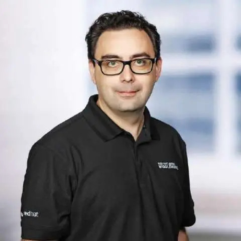

Le Riviera JUG organise une rencontre **gratuite** sur le thème de Quarkus AI le jeudi 16 mai 2024 à partir de 18h dans les locaux de [Amadeus Sophia Antipolis](url:https://goo.gl/maps/agQMwmE74eWqqQvd8).
**Vous pouvez entrer sur le site d'Amadeus avec votre véhicule et vous garer à 2 pas (si vous avez de grandes jambes) de l'amphi où aura lieu la soirée !**

Ah, pour une fois que j'ai une vague idée du sujet de la soirée, vu qu'on parle de Quarkus, et en plus c'est même pas moi qui m'y colle pour en parler, c'est top !

Donc, le programme de cette soirée, c'est Clément qui s'en occupe. On va récapituler 2-3 trucs sur Quarkus, ce que c'est, et les dernières nouveautés, et ensuite on verra comment s'en servir pour utiliser les LLMs de manière ultra-simple. Clément, je bosse avec lui depuis des années, c'est le genre de type, pendant que moi je passe une semaine à essayer de centrer un truc verticalement en CSS, lui aura ajouté 2 extensions Quarkus, rédigé 4 blogs, publié 3 vidéos, donné 2 conférences, passé en revue 34 pull-requests, fixé 53 bugs, répondu à 176 emails et aidé les collaborateurs sur 139 sujets. Pendant que moi, attends, c'était `vertical-align: middle`, non ? Bref, il envoie du steak, et ses présentations sont toujours super bien faites.

Ne manquez pas cette soirée et faites tourner l'info !  :)

# Programme

|Horaire|Description|
|---|---|
|18:00 - 18:30|Accueil|
|18:30 - 19:15|Premier talk : Hello Quarkus|
|19:15 - 19:45|Buffet, boissons|
|19:45 - 20:30|Deuxième talk : Intégrer l’IA dans les Applications d’Entreprise avec Quarkus 3|
|20:30|Troisième mi-temps dans un resto à proximité !|

# Programme détaillé

## Hello Quarkus

Quarkus est une stack pour écrire des applications Java pour le Cloud. En réduisant l’emprunte mémoire et le temps de démarrage, les applications Quarkus permettent en autre d’augmenter la densité de déploiement, le développement d’application serverless en Java, un meilleur comportement dans Kubernetes…

La première release publique de Quarkus a été faite en Mars 2019. Nous voilà 4 ans plus tard avec Quarkus 3.x. Entre temps, Quarkus a grandi, son écosystème s’est enrichi. Mais, Quarkus est resté fidèle à ses principes.

Cette présentation rappelle les points fondamentaux de Quarkus (build-time principle, reactive core, container-first…) et explique leur évolution au cours de ces 4 dernières années ainsi que les nouveautés de Quarkus 3.x tels que la nouvelle dev ui, l’intégration d’Hibernate 6, le passage à Jakarta et à Flow, le support des threads virtuels (project loom), les différentes améliorations de l’expérience pour les développeurs, le support des architectures ARM…

## Intégrer l’IA dans les Applications d’Entreprise avec Quarkus 3

Dans le contexte dynamique de l’intelligence artificielle, l’intégration transparente et fluide des grands modèles de langage (LLM) dans les applications devient une priorité majeure pour les développeurs. Malgré la disponibilité de nombreuses bibliothèques qui facilitent cette intégration, elles tendent souvent à négliger les exigences globales propres aux applications d’entreprise. Au-delà de la simple interaction, une intégration réussie exige une prise en charge solide d’éléments cruciaux tels que les métriques, la tolérance aux pannes, l’audit et l’extensibilité.

Cette présentation plonge dans l’univers de l’intégration de l’IA et particulièrement des LLMs au sein des applications d’entreprise basés sur Quarkus. En partant des principes fondamentaux, nous vous guiderons à travers l’amélioration d’une application Quarkus de base pour répondre aux exigences d’un logiciel d’entreprise. Découvrez comment intégrer l’observabilité, les mécanismes de tolérance aux pannes, les protocoles d’audit et les fonctionnalités de documentation, garantissant ainsi une intégration complète des LLMs dans vos applications Quarkus.

# À propos des speakers

## Clément Escoffier

Clement Escoffier (@clementplop) est distinguished engineer chez Red Hat et aussi un Java Champion. Avant de rejoindre Red Hat, Clement a eu plusieurs vies professionnelles, de postes universitaires au management. Il a contribué à de nombreux projets et produits, touchant au passage à différents domaines et technologies tel que OSGi, mobile, continuous delivery, et DevOps. Clément s’est toujours intéressé à l’ingénierie logicelle, aux systèmes distribués et à l’architecture piloté par les évènements. Il s’est récemment concentré sur les Systèmes Réactifs, les applications Cloud-Native et Kubernetes. Clément a contribué à de nombreux projets open-source comme Apache Felix, Eclipse Vert.x, SmallRye, Mutiny, et Quarkus. Il est aussi l’auteur du livre « Reactive Systems in Java » .

 

# Pour venir

Amadeus, main site, Mistral auditorium
485 Rte du Pin Montard
06410 Biot

Garez-vous à l'intérieur du site !

[Plan d’accès](https://goo.gl/maps/agQMwmE74eWqqQvd8)

<iframe src="https://www.google.com/maps/embed?pb=!1m18!1m12!1m3!1d2334.61087379998!2d7.057556422906037!3d43.62195443006717!2m3!1f0!2f0!3f0!3m2!1i1024!2i768!4f13.1!3m3!1m2!1s0x12cc2b7cba432085%3A0xcb5e30e756ebb5c5!2sAmadeus%20Main%20Site!5e0!3m2!1sen!2sfr!4v1648131547103!5m2!1sen!2sfr" width="600" height="450" style="border:0;" allowfullscreen="" loading="lazy"></iframe>

# Réservation

# Sponsors

|Sponsor|Rôles|
|---|---|
|[.image('amadeus.png')})](https://amadeus.com/fr)  | Salle|
