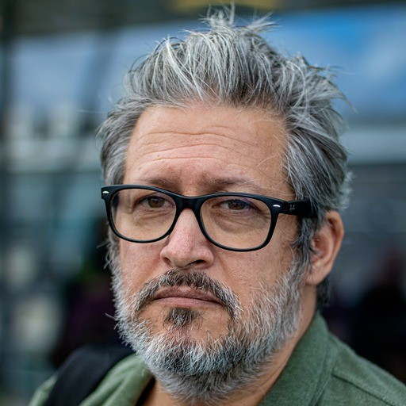

Le Riviera JUG organise une rencontre **gratuite** sur le thème de WASM le mercredi 19 juin 2024 à partir de 18h dans les locaux de [Amadeus Sophia Antipolis](url:https://goo.gl/maps/agQMwmE74eWqqQvd8).
**Vous pouvez entrer sur le site d'Amadeus avec votre véhicule et vous garer à 2 pas (si vous avez de grandes jambes) de l'amphi où aura lieu la soirée !**

WASM… WASM… C'est pas le nom des frelons en anglais ? Ah non, j'suis trop bête, c'est le truc, là, euh, les White Anglo-Saxon Mormons ? Mais si, tu sais, les religieux qui vivent dans le passé, là, avec les chapeaux pointus blancs. Mais bien sûr, ah, heureusement que je suis un expert en US of A, moi !

Purée, heureusement que l'année touche à sa fin, j'ai plus rien, là. Mais non, c'est pas sérieux… Ça va finir par se voir… En fait, on devrait faire comme au Mars JUG et faire un barbecue pendant la dernière séance de l'année, pas se prendre la tête à essayer d'expliquer les sujets du soir… En plus, y'a à parier que Philippe serait partant… Je vais en toucher deux mots à Amadeus, à coup sûr on peut installer un barbecue dans l'amphi, personne remarquera, on fera discret…

Euh, comment, le sujet de la soirée ? Ah ben, une fois n'est pas coûtume, on va parler Web Assembly ! Plus particulièrement, comment créer des plugins WASM pour vos applications. Mais pas comme tout le monde, Philippe à son style bien à lui, un vrai hacker passionné plein de side-projects et d'expérimentations qu'il adore partager, et on vous encourage à venir partager avec lui, on est jamais déçu !

Ne manquez pas cette soirée et faites tourner l'info !  :)

# Programme

|Horaire|Description|
|---|---|
|18:00 - 18:30|Accueil|
|18:30 - 19:15|Premier talk : WASI fonctionnement et limites (et un peu de plomberie)|
|19:15 - 19:45|Buffet, boissons|
|19:45 - 20:30|Deuxième talk : Extism, le framework qui évite la plomberie|
|20:30|Troisième mi-temps dans un resto à proximité !|

# Programme détaillé

## WASI fonctionnement et limites (et un peu de plomberie)

-  Présentation de WASI et des runtimes existants
-  Utilisation avec Node.js (support de WASM par défaut)
-  Utilisation avec GoLang et Wazero (créer une application qui peux exécuter des programmes WASM)

## Extism, le framework qui évite la plomberie

- Extism permet de développer des plugins WASM mais aussi les applications capable de les exécuter
- Principes de fonctionnement
- Mais ça marche aussi pour Java ? (oui :) )
- Conclusion et Perspectives

# À propos des speakers

## Philippe Charrière

Philippe Charrière (plus connu comme @k33g_org on X), vieux geek éleveur de side projects et Sr Solution Architect chez Docker.

 

# Pour venir

Amadeus, main site, Mistral auditorium
485 Rte du Pin Montard
06410 Biot

Garez-vous à l'intérieur du site !

[Plan d’accès](https://goo.gl/maps/agQMwmE74eWqqQvd8)

<iframe src="https://www.google.com/maps/embed?pb=!1m18!1m12!1m3!1d2334.61087379998!2d7.057556422906037!3d43.62195443006717!2m3!1f0!2f0!3f0!3m2!1i1024!2i768!4f13.1!3m3!1m2!1s0x12cc2b7cba432085%3A0xcb5e30e756ebb5c5!2sAmadeus%20Main%20Site!5e0!3m2!1sen!2sfr!4v1648131547103!5m2!1sen!2sfr" width="600" height="450" style="border:0;" allowfullscreen="" loading="lazy"></iframe>

# Réservation

# Sponsors

|Sponsor|Rôles|
|---|---|
|[.image('amadeus.png')})](https://amadeus.com/fr)  | Salle|
