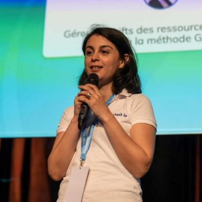

Le Riviera JUG organise une rencontre **gratuite** sur le thème de la sécurisation de Kubernetes le jeudi 16 janvier 2025 à partir de 18h dans les locaux de [Amadeus Sophia Antipolis](url:https://goo.gl/maps/agQMwmE74eWqqQvd8).
**Vous pouvez entrer sur le site d'Amadeus avec votre véhicule et vous garer à 2 pas (si vous avez de grandes jambes) de l'amphi où aura lieu la soirée !**

ACTE I

Kubernetes : « Attends, mais quoi ? 😰 »
Dev : « Ben, j'y vais, quoi… 👋 »
Kubernetes : « Mais… Comme ça ? Tu m'abandonnes ? 😱 »
Dev : « C'est un grand mot, ça… 🙄 J'ai fini, moi, pour une fois à l'heure ⌚, d'ailleurs, j'ai mon cours de pilates, là. Et puis, c'est bon, j'ai tout fini de coder, t'es en prod maintenant, t'en fais pas, tout va bien se passer ! 🦾 »
Kubernetes : « M'enfin, n'importe quoi ?! T'as géré les fonctions internes, c'est sûr… Mais… je me sens un peu à poil, là… 👶 Tout nu, sur internet… D'ailleurs… y'a des requêtes chelou qui me démangent et me plaisent pas trop, là, tu devrais y jeter un coup d'œil, je pense pas que ce soit normal… »
Dev : « Holala, mais quel dramaturge, ce cluster ! Bon, OK, je vais regarder… 🤔 »
Kubernetes : « Dis… je me sens pas bien, là 🤢, je crois que je vais vomir des données… 🤮 BZZZZZ CRRRRR !!! »
Dev : « Kuby !? Kuby ?! Oh purée qu'est-ce qu'il s'est passé ?!?! On l'a perdu ?! On s'est fait hacker !!! Adieu soirée pilates 😭 »

FIN

Un grand classique, et ça se finit toujours comme ça quand on oublie la sécurité. Katia viendra tout nous apprendre pour ne pas répéter les erreurs classiques et sécuriser vos applications avec Kubernetes.

Ne manquez pas cette soirée et faites tourner l'info !  :)

# Programme

|Horaire|Description|
|---|---|
|18:00 - 18:30|Accueil|
|18:30 - 19:15|Katia Himeur : Sécurisation de Kubernetes|
|19:15 - 19:45|Buffet, boissons|
|19:45 - 20:30|Katia Himeur : Sécurisation de Kubernetes|
|20:30|Troisième mi-temps dans un resto à proximité !|

# Programme détaillé

## Sécuriser votre cluster Kubernetes : la recette pour réussir, étape par étape !

Aujourd'hui, après plusieurs années d'existence, une communauté extrêmement active et un écosystème ultra dynamique, Kubernetes s'est imposé comme le standard de facto dans le domaine de l'orchestration de conteneurs. Grâce aux nombreuses offres managées, il n'a jamais été aussi facile et à la portée de tout type de profil, de disposer d'un cluster Kubernetes prêt à l'emploi.

Cependant, cette simplicité à en disposer fait que le sujet de la sécurité dans Kubernetes est laissé souvent à plus tard, voire négligé. Exposant ainsi les entreprises à des risques importants.

Durant ce talk, je vous montrerai, étape par étape, comment sécuriser votre cluster Kubernetes pour gagner en sérénité et en fiabilité.

# À propos des intervenants

## Katia Himeur

CTO et cofondatrice de Cockpit io, entreprise spécialisée dans l’accompagnement autour des sujets Cloud & DevOps, j’accompagne les organisations et les équipes clientes dans leurs projets d’adoption de la culture DevOps et dans leurs projets Cloud. J’interviens dans les phases de conception, de construction et d’optimisation d’infrastructures et d’architectures Cloud et d’usines logicielles. Je vous aide à optimiser les coûts et à sécuriser vos infrastructures.

Mes sujets de prédilection : le Cloud, le DevOps, le FinOps, la sécurité, la conteneurisation, le serverless et l'infrastructure as code.

 

# Pour venir

Amadeus, main site, Mistral auditorium
485 Rte du Pin Montard
06410 Biot

Garez-vous à l'intérieur du site !

[Plan d’accès](https://goo.gl/maps/agQMwmE74eWqqQvd8)

<iframe src="https://www.google.com/maps/embed?pb=!1m18!1m12!1m3!1d2334.61087379998!2d7.057556422906037!3d43.62195443006717!2m3!1f0!2f0!3f0!3m2!1i1024!2i768!4f13.1!3m3!1m2!1s0x12cc2b7cba432085%3A0xcb5e30e756ebb5c5!2sAmadeus%20Main%20Site!5e0!3m2!1sen!2sfr!4v1648131547103!5m2!1sen!2sfr" width="600" height="450" style="border:0;" allowfullscreen="" loading="lazy"></iframe>

# Réservation

[})](https://www.ticketsource.eu/booking/t-rpvllyd)

# Sponsors

|Sponsor|Rôles|
|---|---|
|[.image('amadeus.png')})](https://amadeus.com/fr)  | Salle|
