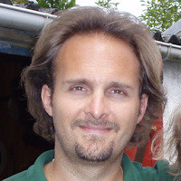

Le Riviera JUG organise une rencontre **gratuite** sur le thème de Kubernetes le jeudi 27 Novembre à partir de 18h dans les locaux de [Amadeus Sophia Antipolis](url:https://goo.gl/maps/agQMwmE74eWqqQvd8).
**Vous pouvez entrer sur le site d'Amadeus avec votre véhicule et vous garer à 2 pas (si vous avez de grandes jambes) de l'amphi où aura lieu la soirée !**

Kubernetes… ça me dit quelque chose ? À force d’en entendre parler, j’ai l’impression qu’il fait carrément partie des meubles. Vous savez, ce truc posé là depuis dix ans, qu'on voit tous les jours sans y prêter attention. Pourtant ça évolue encore beaucoup, et c'est pour ça que jeudi, on va voir comment l’utiliser sans avoir l’air d'être resté bloqué en 2015 !

Ne manquez pas cette soirée et faites tourner l'info ! :)

# Programme

| Horaire       | Description                                    |
| ------------- | ---------------------------------------------- |
| 18:00 - 18:30 | Accueil                                        |
| 18:30 - 19:15 | Alain Regnier : Utiliser Kubernetes en 2025         |
| 19:15 - 19:45 | Buffet, boissons                               |
| 19:45 - 20:30 | Alain Regnier : Récap' KubeCon 2025         |
| 20:30         | Troisième mi-temps dans un resto à proximité ! |

# Programme détaillé

## Utiliser Kubernetes en 2025

Plus de 10 ans après sa sortie en 2014, Kubernetes a beaucoup changé. Pourtant beaucoup d'entreprises continuent d'utiliser Kubernetes de la même manière depuis des années.  

Au cours de cette présentation nous ferons le tour de choses à connaitre pour ne pas utiliser Kubernetes en 2025 comme si on était encore en 2015... (Gateway, kubectl debug, CRD et Operator, CSI et Volume Snapshots, partage de GPU, Image Volumes, eBPF, CEL pour le contrôle d'admission, request/limits au niveau des Pods, Kueue pour gérer les jobs, sécurité...)  

## Récap' KubeCon 2025 à Atlanta

Cette partie sera focalisée sur la KubeCon 2025 à Atlanta dont Alain sera fraichement revenu et présentera la conférence, les grandes annonces et les nouveautés à venir de l'ecosystème Kubernetes.

# À propos des intervenants

## Alain Regnier

Alain Regnier est Architecte Technique et Expert Kubernetes.
Il accompagne les entreprises qui veulent passer à Kubernetes ou s'en servir plus efficacement en suivant les Bonnes Pratiques (stratégie, installation, formation, kubernetisation d'application, audit...)
Depuis le rachat de Kubo Labs par SCIAM, il est Directeur Technique du pôle Kubernetes et DevOps de SCIAM. Auparavant il était CTO de la société Kubo Labs, spécialiste de Kubernetes on premise et sur le Cloud.
Il est GDE Cloud (Google Developer Expert) et a passé 10 ans dans la Silicon Valley où il a notamment participé à la rédaction de plusieurs standards des Web Services et des Objets Connectés.

 

# Pour venir

Amadeus, main site, Mistral auditorium
485 Rte du Pin Montard
06410 Biot

Garez-vous à l'intérieur du site !

[Plan d’accès](https://goo.gl/maps/agQMwmE74eWqqQvd8)

<iframe src="https://www.google.com/maps/embed?pb=!1m18!1m12!1m3!1d2334.61087379998!2d7.057556422906037!3d43.62195443006717!2m3!1f0!2f0!3f0!3m2!1i1024!2i768!4f13.1!3m3!1m2!1s0x12cc2b7cba432085%3A0xcb5e30e756ebb5c5!2sAmadeus%20Main%20Site!5e0!3m2!1sen!2sfr!4v1648131547103!5m2!1sen!2sfr" width="600" height="450" style="border:0;" allowfullscreen="" loading="lazy"></iframe>

# Réservation

[})](https://www.ticketsource.com/rivieradev/t-kdovdmj)

# Sponsors

| Sponsor                | Rôles |
| ---------------------- | ----- |
| https://amadeus.com/fr | Salle |
