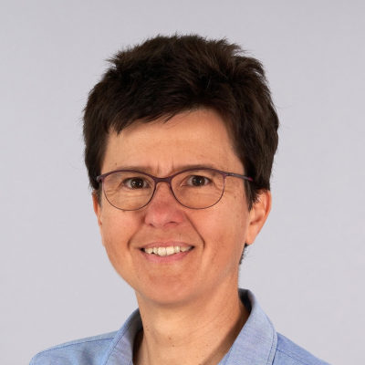

Le Riviera JUG organise une rencontre **gratuite** sur le thème de la **progression de carrière des développeurs Java** le mercredi 10 Juin à partir de 18h dans les locaux de [Amadeus Sophia Antipolis](url:https://goo.gl/maps/agQMwmE74eWqqQvd8).
**Vous pouvez entrer sur le site d'Amadeus avec votre véhicule et vous garer à 2 pas (si vous avez de grandes jambes) de l'amphi où aura lieu la soirée !**

Après quelques années de Java, la vie devient étrange. On se réveille la nuit en se demandant si un Optional<Optional<T>> est une bonne idée, on prétend comprendre les nouveautés des six dernières versions de Java alors qu'on utilise encore les mêmes trois collections depuis 2014, et on acquiesce gravement quand quelqu'un prononce les mots Virtual Threads dans une réunion. Ces deux conférences sont là pour vous aider à reprendre le contrôle avant que vous ne finissiez par contribuer à OpenJDK simplement parce que votre cerveau a refusé d'apprendre un énième framework JavaScript. Entre techniques d'apprentissage issues des neurosciences et découverte des mystérieux rituels qui gouvernent l'évolution de Java, vous repartirez avec de nouvelles compétences, une meilleure compréhension de l'écosystème, et peut-être suffisamment de confiance pour corriger une JEP pendant votre pause déjeuner.

Ne manquez pas cette soirée et faites tourner l'info ! :)

# Programme

| Horaire       | Description                                    |
| ------------- | ---------------------------------------------- |
| 18:00 - 18:30 | Accueil                                        |
| 18:30 - 19:15 | Build your Professional Path by Visualizing How Java Evolves |
| 19:15 - 19:45 | Buffet, boissons                               |
| 19:45 - 20:30 | Be a better Java developer, learn faster and get more results: it's all about the skills!         |
| 20:30         | Troisième mi-temps dans un resto à proximité ! |

# Programme détaillé

## Build your Professional Path by Visualizing How Java Evolves

Java developers are usually looking for the new and best in the technology. Yet… Have you ever wondered how Java evolves and where it’s headed? Have you ever considered that you could be part of Java’s evolution? 

In this talk, I’ll share my discoveries while visualizing Java’s evolution. You will explore the two pillars of Java, the OpenJDK Project and the JCP process, uncover how they relate and discover the secrets that allow you to become a desired professional worldwide.

You’ll understand how Java evolves and how you can follow this evolution so you are always a step ahead of your team. You will also understand the exact way to participate in Java’s future, and how to use that to grow technically and become a Java expert. Along the way, you will also learn how data visualization can make connections visible and understandable in your discussions and projects.

## Be a better Java developer, learn faster and get more results: it's all about the skills!				

Struggling to keep up with technology, or feeling overwhelmed with so many things to learn? Do you feel you are a competent developer, but you don't see the results in your career? Maybe you feel like you don't belong or that you are not good enough?
Those are common symptoms, you are not alone! This talk will show you what's behind those feelings, why you can't keep up, and how to solve that. Come learn what the last 10 years of brain science has shown about our career and what the best developers do differently. Discover the exact skills you need to have to grow, and how to apply them in your project today. Become a better Java developer, create unlimited growth and forge your own path to success.

# À propos des intervenants

## Bruno Souza

Since 1995, Bruno has been helping Java developers advance their careers and work on exciting projects. A recognized Java Evangelist and Java Champion, as well as a board member of the Java Community Process, Bruno founded and leads SouJava, the Brazilian Java Users Society. In his book, "Developer Career Masterplan," Bruno shares insights on career development for senior developers, topics he further explores in his Code4.life project.

 

## Csilla Szántó

Csilla Szántó is a professional Java Software Engineer, focusing on developing web applications and data-driven solutions.

Csilla worked in the industry and for consulting companies in different European countries before joining the field of research and public service.

Her interests include inspiring AI and visualization projects and engagement in software communities.

Csilla is also the creator of the “Java Universe” a visualization of the evolution of Java.

 

# Pour venir

Amadeus, main site, Mistral auditorium
485 Rte du Pin Montard
06410 Biot

Garez-vous à l'intérieur du site !

[Plan d’accès](https://goo.gl/maps/agQMwmE74eWqqQvd8)

<iframe src="https://www.google.com/maps/embed?pb=!1m18!1m12!1m3!1d2334.61087379998!2d7.057556422906037!3d43.62195443006717!2m3!1f0!2f0!3f0!3m2!1i1024!2i768!4f13.1!3m3!1m2!1s0x12cc2b7cba432085%3A0xcb5e30e756ebb5c5!2sAmadeus%20Main%20Site!5e0!3m2!1sen!2sfr!4v1648131547103!5m2!1sen!2sfr" width="600" height="450" style="border:0;" allowfullscreen="" loading="lazy"></iframe>

# Réservation

[})](https://www.ticketsource.com/rivieradev/t-mjezjgq)

# Sponsors

| Sponsor                | Rôles |
| ---------------------- | ----- |
| https://amadeus.com/fr | Salle |
